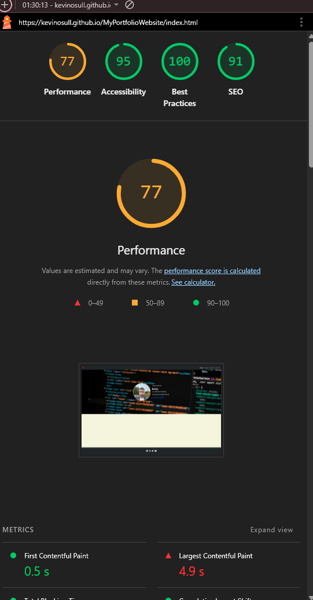

# MyPortfolioWebsite

## Introduction
"MyPortfolioWebsite" is my first assessed portfolio project. This project will showcase my skill in HTML5, CSS and Bootstrap to create
a responsive website showing projects I have done previously and showing employers my skills. This site is designed to showcase my projects and 
show potential employers what I can do.

The live project can be found here "insert link here"

## User Stories
- I am the site owner, I want potential employers to be impressed with my portfolio and offer me work.
- I want a portfolio showcasing my skills in frontend development.
- I want to show off my projects I have worked on in the past to show potential employers what I can do.
- I want to make the sites navigation as seamless and easy to move around.
- I want to make a responsive site for mobile, tablet and desktop.
- I want to make an about me page which clearly states my skills to employers.
- I want to make a clean and slick looking website.
- I want to use this opportunity to reinforce the knowledge I have acquired in learning html and css so far.

## Color Choice
-The website uses a warm beige background for the main content areas, creating a clean and inviting feel. 
-The navigation bar and footer use a dark color to provide contrast, making important elements like links and icons stand out.
-The hero section features a background image with overlayed introductory text, immediately introducing me as a Full Stack Developer. 
-The text is styled for readability, with clear headings and supporting paragraphs, and adjusts responsively on different screen sizes to remain legible. 
-This design guides the visitor’s attention, reinforces branding, and provides a professional first impression.

## Font Choice
The website uses a single font, Roboto Slab, for all text. This serif font provides a clean, modern, and professional look while maintaining good readability across headings, paragraphs, and buttons. Using one consistent font helps unify the design and keeps the focus on the content.

## Wire Frames
Thes wireFrames have been created using Balsamiq to define layout of design and user experience

## Home Page

## Projects Page

## About me Page

## Contact Page

## Images
The portfolio uses three main images: two hero images to set the tone on the Home and About Me pages, and a personal profile image on the home page to introduce myself. The imagery is chosen to create a professional and approachable feel, complementing the site’s content and reinforcing the coding and development theme.

## Navigation
- Main Navigation Bar: Located at the top of every page for consistent access to Home, Projects, About Me, and Contact pages.
- Responsive Menu: Collapses into a hamburger menu on smaller screens (tablet and mobile) for usability on all devices.
- Smooth User Experience: Links clearly labeled and easy to click, ensuring visitors can quickly find the information they need.

## Cards
- Visual Layout: Each project is displayed in a Bootstrap card with a small image, title, description, and link.
- Project Images: Gives a quick visual reference to the project, helping visitors identify your work at a glance.
- Links to Code: Each card includes a clickable button linking to the GitHub repository, making it easy for potential employers to explore your code.
- Consistent Styling: Cards use uniform dimensions and spacing for a clean, professional look.
- Responsive Design: Cards stack vertically on smaller screens, maintaining readability and accessibility across devices.

## Improvements
I would like to imporove a number of things, these include:
- Improving the responsivness on mobile, some of the cards on mobile are stacked really closely together.
- Improve the about me page, add Icons to represent the different languages and technologies I know and present that better.
- Add more content to the contact me page and improve the font style and colourings.

## AI Implementation
I used AI to help me with debugging of issues, especially when content wasn't going where I wanted it to and the AI help me to figure why and how to fix it.

## Impact
AI helped to debug problems I was having with css and it suggested way in which I could fix these problems and thus speeding up my development time.

## Bug
No bugs were found.

## Validation
- Index Page

- Projects Page

- About me Page

- Contact me Page

## LightHouse Validation Mobile and Desktop

- Desktop

- Mobile

